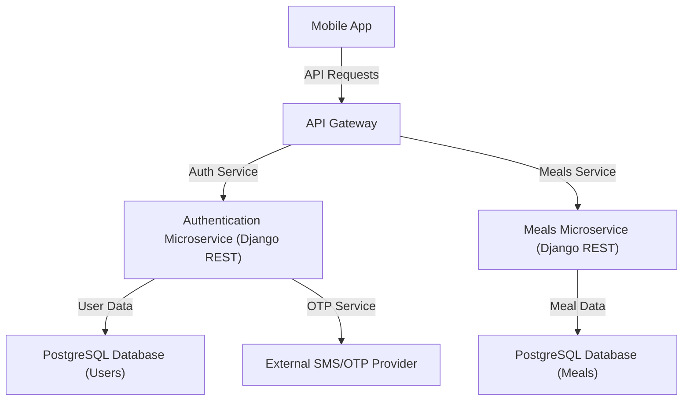
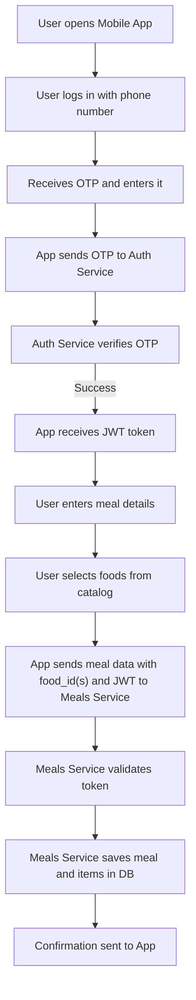

# Self-Recording Health Mobile App – Backend Design (Food Logging Only)

## 1. Database Model (SQL)

### Users Table (`users`)
| Column Name   | Data Type     | Description                |
|---------------|--------------|----------------------------|
| id            | INTEGER      | User ID (Primary Key)      |
| phone_number  | VARCHAR(20)  | Phone number               |
| created_at    | TIMESTAMP    | Registration date          |

### Meals Table (`meals`)
| Column Name   | Data Type     | Description                        |
|---------------|--------------|------------------------------------|
| id            | INTEGER      | Meal ID (Primary Key)              |
| user_id       | INTEGER      | User ID (Foreign Key)              |
| meal_time     | TIMESTAMP    | Date and time of the meal          |
| meal_type     | VARCHAR(20)  | Type (breakfast/lunch/dinner/snack)|
| notes         | TEXT         | Notes                              |
| created_at    | TIMESTAMP    | Record creation date               |

### Food Catalog Table (`food_catalog`)
| Column Name   | Data Type     | Description                |
|---------------|--------------|----------------------------|
| id            | INTEGER      | Food ID (Primary Key)      |
| name          | VARCHAR(100) | Name of the food           |
| calories      | FLOAT        | Calories per 100g/unit     |
| protein       | FLOAT        | Protein (g) per 100g/unit  |
| carbs         | FLOAT        | Carbs (g) per 100g/unit    |
| fat           | FLOAT        | Fat (g) per 100g/unit      |
| fiber         | FLOAT        | Fiber (g) per 100g/unit    |
| sugar         | FLOAT        | Sugar (g) per 100g/unit    |
| sodium        | FLOAT        | Sodium (mg) per 100g/unit  |
| ...           | ...          | Additional nutrients       |

### Meal Items Table (`meal_items`)
| Column Name   | Data Type     | Description                        |
|---------------|--------------|------------------------------------|
| id            | INTEGER      | Item ID (Primary Key)              |
| meal_id       | INTEGER      | Meal ID (Foreign Key)              |
| food_id       | INTEGER      | Food ID (Foreign Key to food_catalog) |
| quantity      | FLOAT        | Quantity                           |
| unit          | VARCHAR(20)  | Unit (g, ml, piece, etc.)          |
| calories      | FLOAT        | Calories (optional, override)      |
| protein       | FLOAT        | Protein (g, optional, override)    |
| carbs         | FLOAT        | Carbs (g, optional, override)      |
| fat           | FLOAT        | Fat (g, optional, override)        |
| ...           | ...          | Additional nutrients (optional)    |

---

## 2. API List (OpenAPI Style)

### 2.1 Login
- **POST /api/auth/login**
  - **Request Body:**  
    ```json
    { "phone_number": "string" }
    ```
  - **Response:**  
    ```json
    { "otp_sent": true }
    ```

### 2.2 OTP Verification
- **POST /api/auth/verify**
  - **Request Body:**  
    ```json
    { "phone_number": "string", "otp": "string" }
    ```
  - **Response:**  
    ```json
    { "token": "string" }
    ```

### 2.3 Create New Meal
- **POST /api/meals**
  - **Header:** Authorization: Bearer {token}
  - **Request Body:**
    ```json
    {
      "meal_time": "datetime",
      "meal_type": "string",
      "notes": "string",
      "items": [
        {
          "food_id": int,
          "quantity": float,
          "unit": "string",
          "calories": float, // optional override
          "protein": float,  // optional override
          "carbs": float,    // optional override
          "fat": float       // optional override
        }
      ]
    }
    ```
  - **Response:**
    ```json
    { "meal_id": int }
    ```

### 2.4 Get Meals List
- **GET /api/meals**
  - **Header:** Authorization: Bearer {token}
  - **Query Parameters:**  
    - from_date (optional)
    - to_date (optional)
  - **Response:**
    ```json
    [
      {
        "id": int,
        "meal_time": "datetime",
        "meal_type": "string",
        "notes": "string",
        "items": [
          {
            "food_name": "string",
            "quantity": float,
            "unit": "string",
            "calories": float
          }
        ]
      }
    ]
    ```

### 2.5 Update Meal
- **PUT /api/meals/{meal_id}**
  - **Header:** Authorization: Bearer {token}
  - **Request Body:** Same as POST /api/meals
  - **Response:**
    ```json
    { "success": true }
    ```

### 2.6 Delete Meal
- **DELETE /api/meals/{meal_id}**
  - **Header:** Authorization: Bearer {token}
  - **Response:**
    ```json
    { "success": true }
    ```

### 2.7 Food Catalog Endpoints
- **GET /api/foods**
  - **Description:** Get list of foods from catalog
  - **Response:**
    ```json
    [
      {
        "id": int,
        "name": "string",
        "calories": float,
        "protein": float,
        "carbs": float,
        "fat": float,
        "fiber": float,
        "sugar": float,
        "sodium": float
      }
    ]
    ```
- **POST /api/foods** (admin only)
  - **Description:** Add new food to catalog
  - **Request Body:**
    ```json
    {
      "name": "string",
      "calories": float,
      "protein": float,
      "carbs": float,
      "fat": float,
      "fiber": float,
      "sugar": float,
      "sodium": float
    }
    ```
  - **Response:**
    ```json
    { "food_id": int }
    ```

---

## 3. Architecture Diagram



---

## 3.1 Meal Logging Flowchart

Below is a flowchart describing the process of logging a meal, now including בחירת מזון מקטלוג:



---

## 4. Technology Stack & Rationale

### 4.1 Backend Framework: **Django + Django REST Framework**
- **Why Django?**
  - Mature, robust, and secure web framework.
  - Built-in admin interface for easy data management.
  - Excellent support for relational databases and ORM.
  - Django REST Framework (DRF) makes building RESTful APIs straightforward and well-documented.
- **Why Microservices?**
  - Each core feature (e.g., authentication, meal logging) is developed and deployed as an independent service.
  - Improves scalability, maintainability, and allows independent development and deployment.
  - Each service can have its own database, reducing coupling and improving data security.

### 4.2 Database: **PostgreSQL**
- **Why PostgreSQL?**
  - Powerful, open-source relational database.
  - Excellent support for complex queries and data integrity.
  - Scalable and reliable for both small and large-scale applications.
  - Well-supported by Django ORM.

### 4.3 API Gateway
- **Role:**  
  - Central entry point for all client requests.
  - Routes requests to the appropriate microservice (e.g., authentication, meals).
  - Handles cross-cutting concerns such as authentication, rate limiting, and logging.
- **Possible Technologies:**  
  - NGINX or AWS API Gateway.

### 4.4 Authentication & OTP
- **JWT (JSON Web Token):**  
  - Used for stateless, secure authentication between client and backend.

### 4.5 Containerization & Deployment
- **Docker:**  
  - Each microservice runs in its own container for isolation and easy deployment.
- **Orchestration:**  
  - Kubernetes or Docker Compose for managing multiple services.
- **Cloud Hosting:**  
  - AWS, Google Cloud, or Azure for scalable, managed infrastructure.

### 4.6 API Documentation
- **OpenAPI/Swagger:**  
  - Auto-generated documentation for all REST endpoints, making it easy for frontend and QA teams to understand and test the API.

---

## 5. Design Rationale

- **Django** was chosen for its reliability, security features, and rapid development capabilities, especially when combined with Django REST Framework for API creation.
- **Microservices architecture** allows each feature to scale independently, simplifies codebases, and enables teams to work in parallel.
- **PostgreSQL** is a robust, production-grade database that integrates seamlessly with Django and supports complex data relationships.
- **API Gateway** centralizes request management, improving security and maintainability.
- **JWT** provides secure, stateless authentication, ideal for mobile applications.
- **Docker** and orchestration tools ensure the system is portable, scalable, and easy to deploy in any environment.
